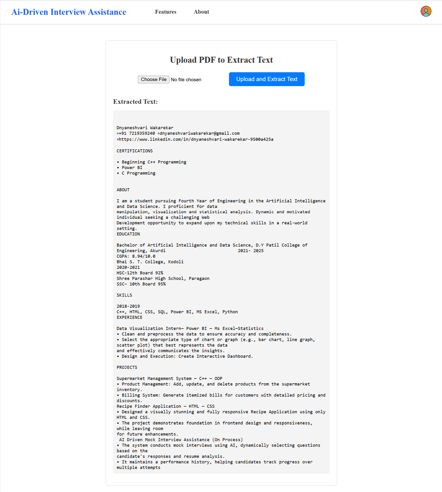
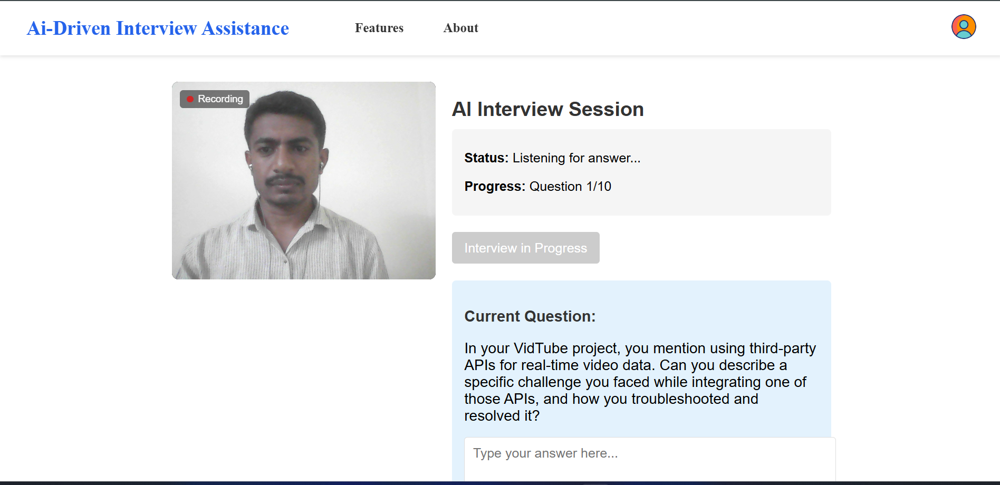

# AI-Driven Interview Assistance - Mock Interview Simulator

**AI-Driven Interview Assistance** is a full-stack, AI-powered mock interview simulation platform built with the **MERN stack** (MongoDB, Express.js, React.js, Node.js). The AI module is implemented using **Python**, leveraging natural language processing (NLP), machine learning (ML), and the **Gemini API** to dynamically generate questions, analyze responses, and provide actionable feedback. This platform empowers users to prepare for technical interviews through interactive sessions featuring real-time video/audio capture, intelligent question generation based on resume analysis, and personalized feedback.

---

## Table of Contents

- [Preview](#preview)
- [Features](#features)
- [Technologies Used](#technologies-used)
- [Usage](#usage)
- [Architecture](#architecture)
- [Deployment](#deployment)
- [Team Members](#team-members)
- [Contact](#contact)
- [Acknowledgments](#acknowledgments)

---

## Preview

  
*Upload your resume to begin the personalized interview session.*

  
*Real-time AI interview simulation with dynamic question generation and media recording.*

.png)  
*Get detailed performance analytics and improvement suggestions.*

---

## Features

### 🎯 Core Functionalities:

- **Resume Upload & Parsing**: Analyzes user resumes to extract skills and experience using NLP.
- **AI-Driven Question Generation**: Dynamically generates domain-relevant questions based on the user's resume using the Gemini API.
- **Adaptive Interview Flow**: Adjusts question difficulty in real-time based on user responses.
- **Speech Interaction**: Records and transcribes answers using Speech-to-Text APIs.
- **AI Feedback Engine**: Utilizes the Gemini API to provide constructive feedback on clarity, accuracy, and technical depth of answers.

### 💻 Frontend Highlights:

- Built with **React.js** and styled using **CSS**.
- **Responsive Design** compatible with desktop and mobile.
- Utilizes **React Router** for seamless navigation.
- Integrated **MediaDevices API** and **Web Speech API** for video/audio capture and transcription.

### 🔧 Backend Highlights:

- **Express.js API** to handle resume parsing, question generation, and feedback processing.
- **MongoDB Atlas** for secure and scalable data storage.
- Python-based AI module integrated with **Gemini API** for question and feedback logic.

---

## Technologies Used

- **Frontend**: React.js, CSS, React Router, MediaDevices API, Web Speech API
- **Backend**: Node.js, Express.js
- **AI Module**: Python (NLP, Machine Learning, Gemini API)
- **Database**: MongoDB Atlas
- **Deployment**: Vercel (Frontend), Render (Backend)
- **Tools**: Git, GitHub, Postman

---

## Usage

1. **Start Interview**: Access the platform and upload your resume (PDF).
2. **Resume Analysis**: Backend parses resume and identifies relevant skills.
3. **Interactive Interview**: AI starts asking questions via voice; you respond via video/audio.
4. **Transcription & Evaluation**: Responses are transcribed and sent to Gemini API for evaluation.
5. **Receive Feedback**: View insights on your performance and retry for improvement.

---

## Architecture

```plaintext
Frontend (React.js)
│
├── Resume Upload → Backend (Express)
├── Video/Audio Capture
├── Fetch AI Questions → Python AI Module (Gemini API)
└── Feedback Display ← Backend Evaluation

Backend (Node.js + Express)
│
├── Resume Parser
├── AI Question Generator ← Python + Gemini API
├── Response Evaluator ← Gemini API
└── MongoDB (Persistent Storage)
```

<!-- ---

## Deployment

- **Frontend**: [https://ai-interview-sim.vercel.app](https://ai-interview-sim.vercel.app)
- **Backend**: Deployed on Render (Private Instance)

--- -->

## Team Members

This project was collaboratively developed as a final year engineering project by the following team members:

- 🎓 **Dnayaneshvari Wakarekar** – Team Leader (Project Coordination & Management)
- 👩‍💻 **Nikita Jadhav** – Frontend & Integration
- 👨‍💻 **Rohan Bhoge** – Python AI Module & AI API Integration
- 👨‍💻 **Shreyash Shedage** – Backend & Integration

---

## Contact

- **Email**: [bhogerohan12@gmail.com](mailto:bhogerohan12@gmail.com)
- **GitHub**: [https://github.com/RohanBhoge](https://github.com/RohanBhoge)
- **LinkedIn**: [https://www.linkedin.com/in/rohanbhoge](https://www.linkedin.com/in/rohanbhoge)

---

## Acknowledgments

- Thanks to **Gemini API**, **OpenAI**, **Web APIs**, and the **open-source developer community** for their invaluable contributions.
- Inspired by real-world tech interview platforms and modern advancements in AI.
- Special thanks to our project guide Prof. *Snehal Malpani* at D.Y. Patil College of Engineering, Akurdi, Pune for their support and guidance.

